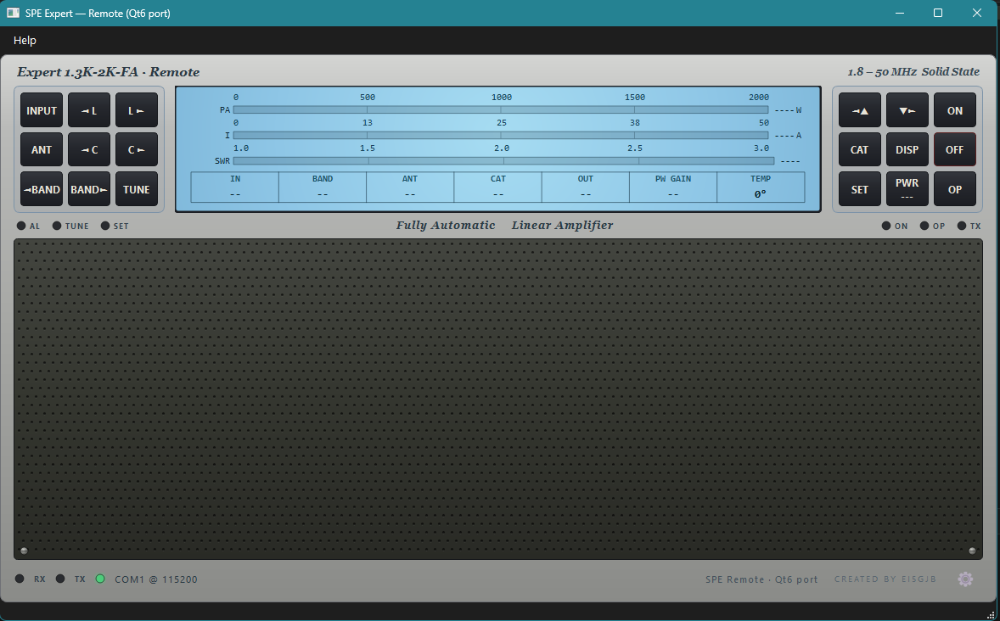
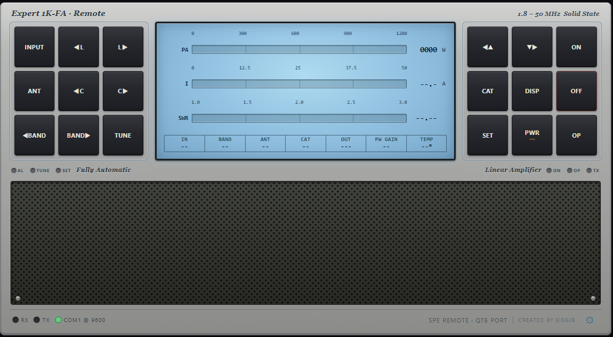
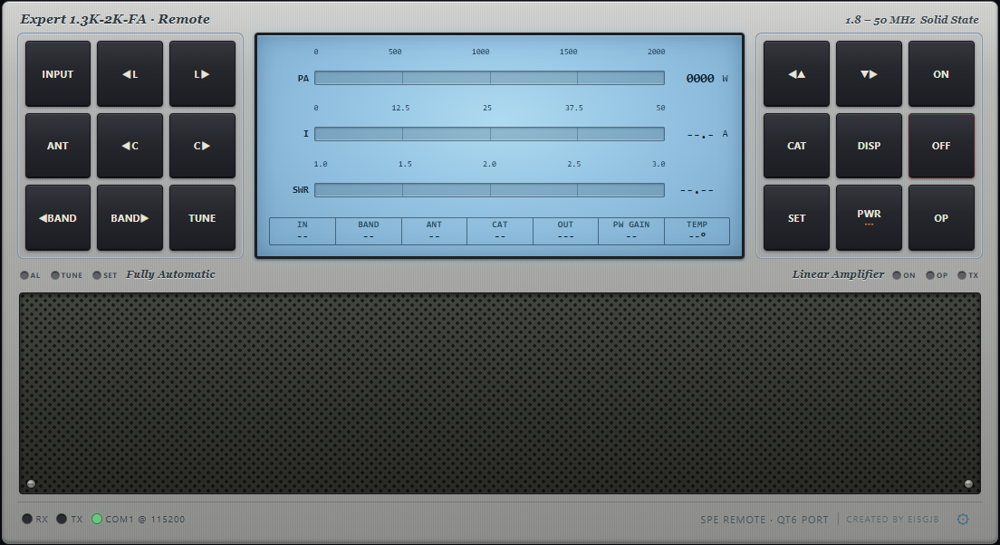
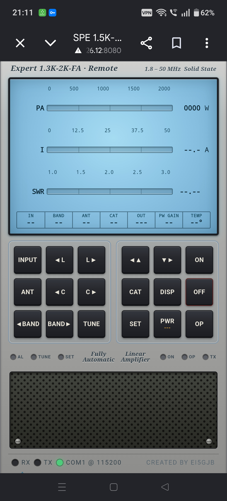
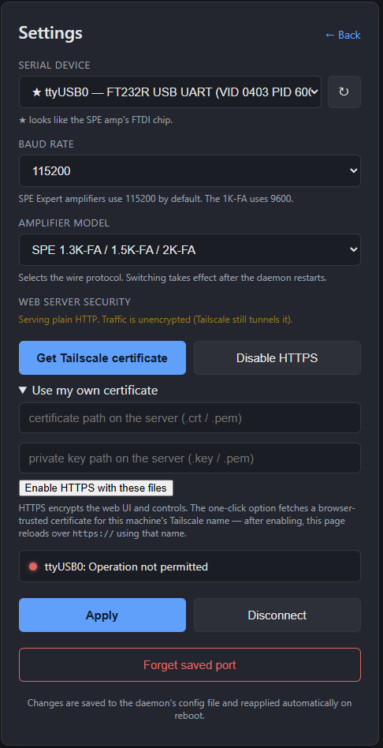

# SPE Expert Amplifier Remote

Control your **SPE Expert** HF amplifier from anywhere.

A native app + browser UI that mirrors the real SPE front panel and drives the
amplifier over USB, then lets you reach it from another room or another country
over an **encrypted Tailscale tunnel**. No port forwarding, no exposing your
home network, no fees.

Supports the **SPE Expert 1K-FA**, **1.3K-FA**, **1.5K-FA**, **1.5K-FA TAURUS**,
and **2K-FA** — pick your exact model on the Settings page.

> **Downloads are on the [Releases page](../../releases/latest).**
> Pick the file for your system — see the per-OS guides below.

---

## What it looks like

**Native desktop app** — Windows shown; the same UI runs on macOS and Linux.
Mirrors the real SPE front panel and talks to the amplifier over USB.



**Browser UI — Expert 1K-FA.** Same control panel served as a web page by the
daemon running next to the amp. Meters scale to the 1K-FA's 1000 W / 25 A range.



**Browser UI — Expert 1.3K-FA / 1.5K-FA / 2K-FA.** Same page, with meters
scaled to the 2 kW family's 2000 W / 50 A range. The amp model is picked once
on the Settings page; the UI relabels itself automatically.



**On a phone** — the web UI lays itself out vertically on a narrow screen,
so you can run the amp from a phone over Tailscale with no extra app.



**Settings page** — pick the serial port, then **choose your exact amplifier
from the model dropdown** (1K-FA, 1.3K-FA, 1.5K-FA, 1.5K-FA TAURUS, or 2K-FA)
so the app matches your radio. You can also turn on browser-trusted HTTPS in
one click using your Tailscale MagicDNS name. Everything saves to the daemon's
config and survives reboots.



---

## How it connects (the big picture)

You run the **SPE Remote** app on a PC (or Raspberry Pi) connected to the
amplifier by USB. That app serves a control panel. **Tailscale** then wraps the
*entire* connection between you and that panel in a private, encrypted
(WireGuard) tunnel — so only your own devices can reach it, and nothing is ever
published to the public internet.

```
        AT THE SHACK (home)                                  YOU — ANYWHERE
 ┌──────────────────────────────────┐                ┌───────────────────────────┐
 │   SPE Expert amplifier            │                │  Laptop · phone · shack PC │
 │            │ USB cable            │                │                           │
 │   ┌────────▼─────────────────┐    │                │   ┌───────────────────┐   │
 │   │  SPE Remote (the server) │    │                │   │ Browser, or the    │   │
 │   │  web UI  :8080            │    │                │   │ SPE Remote Connect │   │
 │   │  controls :8888           │   │                │   │ app                │   │
 │   └────────┬─────────────────┘    │                │   └─────────┬─────────┘   │
 └────────────┼─────────────────────┘                └─────────────┼─────────────┘
              │                                                      │
              │                                                      │
              ╰───────────────── TAILSCALE ──────────────────────────╯
                  one encrypted WireGuard tunnel wraps the whole
                  data stream — private to your devices, nothing
                  is exposed to the public internet

         You open:  https://your-amp.your-tailnet.ts.net:8080/   →   live amp control
```

**The three pieces:**

| Piece | What it is | Runs on |
|---|---|---|
| **SPE Remote (server)** | The app at the amp. Talks to the amplifier over USB and serves the control panel. | The PC/Pi plugged into the amp |
| **Tailscale** | A free, private mesh VPN. Encrypts and routes the connection between your devices. Installed on **both** ends. | Every device |
| **The client** | Any web browser, or the one-click **SPE Remote Connect** app on a remote PC. | Wherever you're operating from |

Everything in this guide is **free**.

---

## Quick start (3 steps)

1. **At the amp:** install the app for your OS and connect to the amplifier
   (USB → pick the serial port + model). Guides below.
2. **Tailscale:** install it on the amp PC *and* on the device you'll operate
   from, signed in to the **same account**. See **[Tailscale setup](docs/tailscale-setup.md)**.
3. **Connect:** from your other device, open
   `http://your-amp-name.your-tailnet.ts.net:8080/` — or turn on **HTTPS** for
   a padlock (one click, [how-to](docs/tailscale-setup.md#trusted-https)).

---

## Per-OS install & setup guides

Each guide walks you through the whole thing for that system — install the app,
connect the amp, set up Tailscale, and reach it remotely (with HTTPS).

- 🪟 **[Windows](docs/install-windows.md)**
- 🍎 **[macOS](docs/install-macos.md)**
- 🐧 **[Linux (desktop)](docs/install-linux.md)**
- 🍓 **[Raspberry Pi (headless)](docs/install-raspberry-pi.md)**

Then:

- 🔐 **[Tailscale setup & trusted HTTPS](docs/tailscale-setup.md)** — the shared,
  one-time account steps (used by every OS guide).
- 📻 **[Amplifier setup — 1K-FA vs 1.3K–2K-FA](docs/amplifier-setup.md)** — serial
  port, baud rate, model selection, and the per-model differences.
- 💻📱 **[Operating from another PC or a phone](docs/connect-remote-and-phone.md)**
  — the one-click SPE Remote Connect app, and Add-to-Home-Screen on Android/iOS.

---

## Is it secure?

Yes. The connection between your devices rides **Tailscale's WireGuard tunnel**
— modern, audited encryption — and your amp's control server is **never exposed
to the public internet**. Only devices signed in to *your* Tailscale account can
reach it. You can additionally enable **HTTPS** for an end-to-end TLS padlock on
top of the tunnel.

---

## Licence & disclaimer

Free for personal, amateur-radio use. Please read **[EULA.txt](EULA.txt)** —
in short: **use entirely at your own risk**, provided "as is" with no warranty,
and the author accepts no liability for any damage to equipment or otherwise.
You are responsible for safe and licence-compliant operation of your station,
especially for remote/unattended use. Third-party components are listed in
**[THIRD-PARTY-NOTICES.txt](THIRD-PARTY-NOTICES.txt)**.

© 2024–2026 Leslie McCarthy (EI5GJB). All rights reserved.
